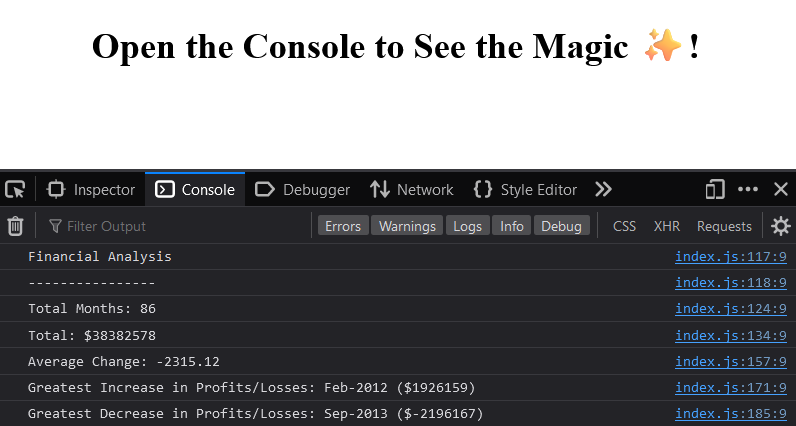

# 💲 console-finances 💲
Welcome to the Console Finances repository! This JavaScript application analyzes a company's financial records and provides insightful data, such as total months, profit/loss sums, average changes, and peak increases and decreases.

## 🚀 Live Version

Experience the live version of Console Finances [HERE](https://thevisualriot.github.io/console-finances/)

## 📝 Description
Console Finances processes databases stored in 2-dimensional arrays to output valuable information about a company's financial records, including:
- Total number of months represented in the database.
- Cumulative amount of profits and losses.
- Average change in profits and losses.
- Greatest increase in profits.
- Greatest decrease in losses.

## 🔣 The Logic
Before diving into code, I broke down the problem into manageable steps, as outlined in the following pseudo code:

1. `totalMonths` variable to count the number of months in the dataset:
    - Use `array.length` to count the number of rows in the array.
    
2. `totalNet` variable to calculate the total profit/loss over the entire period:
    - Initialize `totalNet` to 0.
    - Iterate and access the profit/loss value at index 1 of each sub-array.
    - Add this value to `totalNet`.
        
3. `averageChange` variable to calculate the average change in profit/loss over the entire period:
    - Initialize `averageChange` to 0.
    - Create a new array `changes` to store the difference in profit/loss between consecutive months.
    - Iterate through each sub-array of the dataset (starting from the second row):
    - Calculate the difference between the profit/loss value of the current month and the previous month and add this difference to the `changes` array.
    - Calculate the sum of all values in the `changes` array.
    - Divide the sum by the total number of months minus 1, and store the result in `averageChange`.
        
4. `greatestIncrease` variable to find the greatest increase in profits over the entire period:
    - Initialize `greatestIncrease` to 0.
    - Iterate through the `changes` array to find the maximum value and store it in `greatestIncrease`.
    - Compare with `finances` array to find the month corresponding to this maximum change.
        
5. `greatestDecrease` variable to find the greatest decrease in losses over the entire period:
    - Initialize `greatestDecrease` to 0.
    - Iterate through the `changes` array to find the minimum value and store it in `greatestDecrease`.
    - Compare with `finances` array to find the month corresponding to this minimum change.

## 💻 JS Elements

#### For loops
For loops were utilized to iterate through the data array, performing operations such as summation, subtraction, and adding values to the 2-dimensional array.

#### If statement
If statements were employed to compare array values and retrieve corresponding data from another column.

#### Math
Math methods, specifically Math.min() and Math.max(), were used to find the smallest and largest values in an array. 

## 📜 License
This project is licensed under the [MIT License](https://choosealicense.com/licenses/mit/)